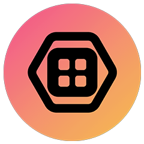

  <h3 align="center"> 
  <a href="https://twitch.tv/skate702">🎉 Coming soon...</a></h3>

&nbsp;

## ASDF - Advanced Stream Deck Features

<!--

-->

[Elgato Stream Decks](https://www.elgato.com/us/en/s/explore-stream-deck) are, without a doubt, powerful hardware ([and software](https://www.elgato.com/us/en/s/virtual-stream-deck)) controllers for streamers, content creators, developers, and anyone looking to enhance their productivity. However, there is *always* room for improvement. This is **ASDF**, a collection of advanced stream deck features. This project has three main goals:

1. **Empower power users**: Provide advanced features and customization for really experienced users (like me 🤓).

2. **Bend the boundaries**: Push the limits of what Stream Decks can do, exploring new possibilities.

3. **Be an inspiration**: Some features may inspire the community and also the software developers over at Elgato 😉

## Features 

This project is split up into features that can be used independently. 
Each feature has its own folder and a README file explaining its purpose, installation instructions, and usage. 
Features have a lifecycle as marked by [badges](BADGES.md).

### 1. Paste icon from clipboard shortcut

Since Stream Deck software 6.9, it is possible to paste an icon from the clipboard. 
However, there is no shortcut to do so. 
This feature adds the shortcut `Ctrl+Shift+V` to paste an icon from the clipboard.

## Ideas

There are many more ideas, some of which are collected here. If you want to add your ideas, please feel free to [open an issue](https://github.com/sebinside/ASDF/issues). Already collected ideas are:

* Ctrl + F to search for actions in the action list
* Templates to bind virtual stream decks to special buttons like the Copilot button or the right control/alt keys
* Keyboard-only control for specific virtual stream deck forms
* Better stream deck choose dialog for the stream deck software
* DummyDeck: A drag-and-drop dummy stream deck window to simplify action organization and storage
* AHK2VSD: Trigger VSD actions using AutoHotkey v2 scripts
* Mirror physical stream deck to virtual stream deck and vice versa (including, e.g., altering button states like removing labels)
* Virtual stream deck weapon wheel mod
* Sticky virtual stream decks (change position and visibility based on other windows)
* Reset mouse position after VSD button click ([#1](https://github.com/sebinside/ASDF/issues/1))
* Explain my Stream Deck: Generate documentation for a given Stream Deck profile
* Vision: Stream Deck profiles as code
